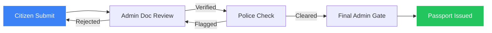

# 🛂 PassportEase — Online Passport Application Portal

[](https://passport-ease.vercel.app)
[](https://supabase.com)
[](https://developer.mozilla.org/en-US/docs/Web/JavaScript)
[](https://developer.mozilla.org/en-US/docs/Web/CSS)

> **PassportEase** is a cutting-edge, government-grade passport application portal. Built with a focus on premium aesthetics and robust functionality, it streamlines the entire passport journey from initial application to final issuance using a high-performance, framework-less architecture.

---

## ✨ Premium Features

### 🏢 Multi-Portal Ecosystem
*   **Citizen Portal:** 6-step smart application wizard with renewal auto-fill, document preview, and real-time tracking.
*   **Admin Dashboard:** Comprehensive oversight with granular document verification, user management, and helpdesk tracking.
*   **Police Portal:** Secure city-based verification system with integrated Aadhaar-based criminal database lookup.

### 🛡️ Secure Engineering
*   **Watermarked Security:** Automatic semi-transparent world map overlay on all citizen-uploaded sensitive documents.
*   **Real-time Persistence:** Powered by **Supabase REST API** with a dedicated `pe_store` for configuration and `pe_applications` for data.
*   **Fully Online:** Optimized digital workflow with no physical appointment required as of April 2026.

### 🎨 State-of-the-Art UX
*   **Glassmorphism UI:** Modern design system with vibrant gradients, frosted-glass effects, and micro-animations.
*   **Accessibility First:** Integrated font-size controls (A-/A/A+), screen reader optimization, and multilingual (i18n) support.
*   **Responsive AI:** 24/7 AI-powered support chatbot to guide users through the workflow.

---

## 🛠️ Tech Stack

| Component | Technology | Description |
|-----------|------------|-------------|
| **Frontend** | Vanilla HTML5 / CSS3 / ES6+ | Zero-dependency, high-performance core |
| **Styling** | Custom CSS Design System | Variables, themes, glassmorphism, and smooth transitions |
| **Backend** | Supabase (PostgreSQL) | Real-time cloud persistence & RESTful API |
| **Logic** | `shared.js` & `i18n.js` | Modular API wrappers and internationalization engine |
| **Hosting** | Vercel | Global CDN deployment with clean URL routing |

---

## 🔄 The 5-Step Verification Pipeline

PassportEase implements a strict, sequential verification workflow to ensure maximum security.



1.  **Submission:** Citizen completes the 6-step wizard (fully online).
2.  **Document Verification:** Admin reviews each document. Rejected documents can be re-uploaded individually.
3.  **Police Verification:** Officers verify criminal records based on city assignment.
4.  **Admin Approval:** The final seal of approval after all background checks.
5.  **Issuance:** A unique passport number is generated and the application is closed.

---

## 📂 Project Structure

```text
Passport-Ease/
├── index.html                  # Landing page with hero, stats, map & fee calc
├── html/                       # Application pages (login, apply, track, admin, police)
├── css/                        
│   └── styles.css              # Central design system & theme variables
├── js/                         
│   ├── shared.js               # Supabase API client (PE.*) & core utilities
│   ├── i18n.js                 # Site-wide translation manager
│   ├── chatbot.js              # AI assistant logic
│   └── [page].js               # Page-specific business logic
├── assets/                     # Maps, icons, and static images
├── vercel.json                 # Routing & Security configuration
└── schema.sql                  # Database structure for Supabase setup
```

---

## 🚀 Rapid Deployment

### ☁️ Vercel (Deployment)
1. Fork/Push this repository to GitHub.
2. Connect to [Vercel](https://vercel.com) and import the repo.
3. Keep settings as **Other** (no build command needed).
4. Click **Deploy**.

### 💻 Local Development
```bash
# Clone the repository
git clone https://github.com/sahil-kau5hik/Passport-Ease.git

# Navigate and serve
cd Passport-Ease
npx serve .
```

---

## 🗄️ Database Setup (Supabase)

Initialize your database by running the `schema.sql` (or `supabase_setup.sql`) in your Supabase SQL Editor.

| Table | Function |
|-------|----------|
| `pe_store` | Global KV store for themes, slots, and counters |
| `pe_applications` | Core application records (JSONB doc_data) |
| `pe_users` | Citizen account management |
| `pe_complaints` | Tech support & helpdesk logs |

---

## 🔒 Security & Performance

*   **Offline Fallback:** Graceful degradation to `localStorage` if Supabase becomes unreachable.
*   **SEO Optimized:** Semantic HTML5, descriptive meta tags, and structured sitemaps.
*   **RLS Policies:** Row Level Security enabled for data protection.
*   **Asset Optimization:** Debounced inputs (500ms) and Base64 previews for low latency.

---

*Handcrafted with ❤️ for the Digital India initiative.*
